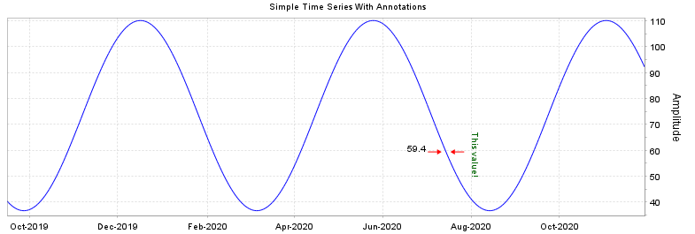
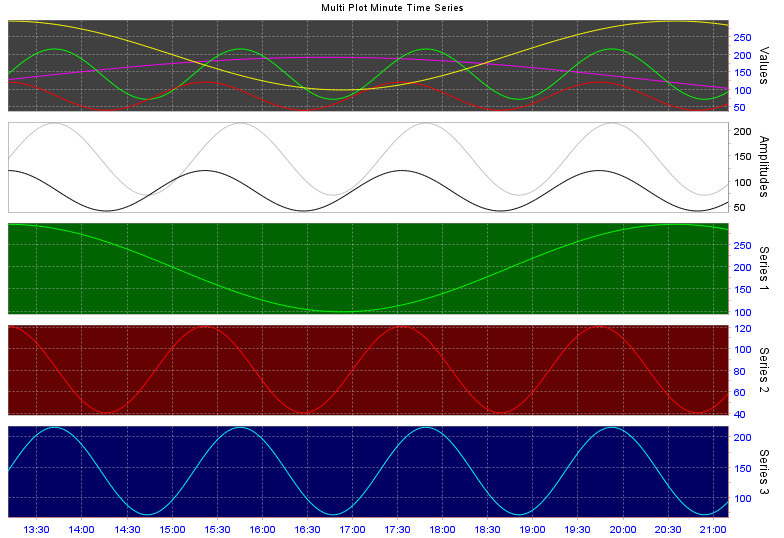
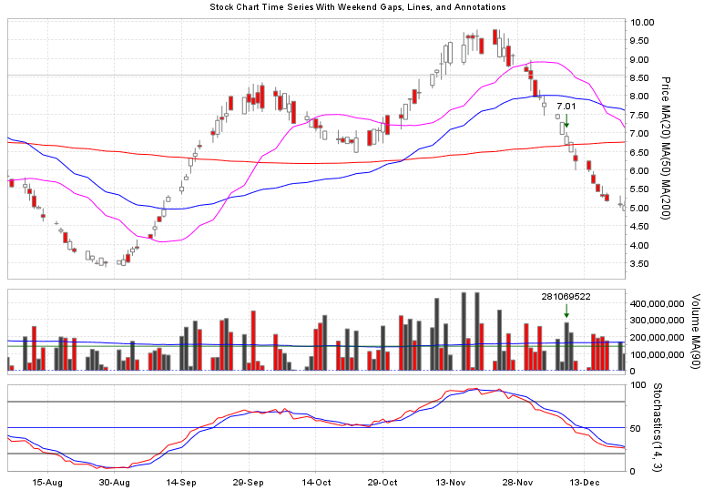

# jfreechart-builder

A [builder pattern](https://en.wikipedia.org/wiki/Builder_pattern) module for working with the [jfreechart](https://github.com/jfree/jfreechart) library. Meant as a companion to [ChartFactory.java](https://github.com/jfree/jfreechart/blob/master/src/main/java/org/jfree/chart/ChartFactory.java) to build more complex charts with fewer lines of code.

Takes an opinionated approach to creating "good enough" charts while providing a more declarative way of parameterizing them.


## Capabilities

* XY time series plots using a [CombinedDomainXYPlot](https://github.com/jfree/jfreechart/blob/master/src/main/java/org/jfree/chart/plot/CombinedDomainXYPlot.java) in all cases. This produces left-to-right horizontal time axes and vertical value axes. The time axis is meant to be shared by all sub-plots. If you need different time axes then you'll need to `build()` multiple charts and lay those out as desired in your app.

* Stock market OHLC candlestick charts

* Stock market volume bar charts

* Stright lines

* Annotations (arrows and text)

In the future, more parameterization may be added like specifying background and axis colors, or even the actual series renderer objects themselves to fully leverage what [jfreechart](https://github.com/jfree/jfreechart) provides.

## Samples

Code like this:

```
ChartBuilder.get()
  .title("Simple Time Series With Annotations")
  .timeData(timeArray)
  .xyPlot(XYPlotBuilder.get()
    .series(XYTimeSeriesBuilder.get().name("Amplitude").data(array1).color(Color.BLUE).style(SOLID_LINE))
    .annotation(XYArrowBuilder.get().x(arrowX).y(arrowY).angle(180.0).color(Color.RED).text(arrowTxt))
    .annotation(XYArrowBuilder.get().x(arrowX).y(arrowY).angle(0.0).color(Color.RED))
    .annotation(XYTextBuilder.get().x(arrowX).y(arrowY).color(DARK_GREEN)
      .text("This value!").textPaddingLeft(5).textAlign(TextAnchor.BASELINE_LEFT).angle(90.0)))
  .build()
```

Produces a chart like this:



Multiple series can be multi-plotted like this:

```
public static final Stroke SOLID = new BasicStroke(1.0f, BasicStroke.CAP_BUTT, BasicStroke.JOIN_ROUND);

private static final Color DARK_GREEN = new Color(0, 150, 0);

ChartBuilder.get()

  .title("Multi Plot Minute Time Series")

  .timeData(timeArray)

  .xyPlot(XYPlotBuilder.get().yAxisName("Values")
    .series(XYTimeSeriesBuilder.get().data(array1).color(Color.BLUE).style(SOLID))
    .series(XYTimeSeriesBuilder.get().data(array2).color(Color.RED).style(SOLID))
    .series(XYTimeSeriesBuilder.get().data(array3).color(DARK_GREEN).style(SOLID))
    .series(XYTimeSeriesBuilder.get().data(array4).color(Color.MAGENTA).style(SOLID)))

  .xyPlot(XYPlotBuilder.get().yAxisName("Amplitudes")
    .series(XYTimeSeriesBuilder.get().data(array2).color(Color.GRAY).style(SOLID))
    .series(XYTimeSeriesBuilder.get().data(array3).color(Color.LIGHT_GRAY).style(SOLID)))

  .xyPlot(XYPlotBuilder.get().yAxisName("Series 1")
    .series(XYTimeSeriesBuilder.get().data(array1).color(Color.BLUE).style(SOLID)))

  .xyPlot(XYPlotBuilder.get().yAxisName("Series 2")
    .series(XYTimeSeriesBuilder.get().data(array2).color(Color.RED).style(SOLID)))

  .xyPlot(XYPlotBuilder.get().yAxisName("Series 3")
    .series(XYTimeSeriesBuilder.get().data(array3).color(DARK_GREEN).style(SOLID)))

.build()
```

Produces a chart like this:



Stock chart code and data like this:

```
ChartBuilder.get()

  .title("Stock Chart Time Series With Weekend Gaps, Lines, and Annotations")
  .timeData(timeArray)

  .xyPlot(OhlcPlotBuilder.get().yAxisName("Price").plotWeight(3)
    .series(OhlcSeriesBuilder.get().ohlcv(dohlcv).upColor(Color.WHITE).downColor(Color.RED))
    .series(XYTimeSeriesBuilder.get().name("MA(20)").data(sma20).color(Color.MAGENTA).style(SOLID_LINE))
    .series(XYTimeSeriesBuilder.get().name("MA(50)").data(sma50).color(Color.BLUE).style(SOLID_LINE))
    .series(XYTimeSeriesBuilder.get().name("MA(200)").data(sma200).color(Color.RED).style(SOLID_LINE))
    .annotation(XYArrowBuilder.get().x(stockEventDate).y(stockEventPrice).angle(270.0).color(DARK_GREEN)
      .textAlign(TextAnchor.BOTTOM_CENTER).text(String.format("%.2f", stockEventPrice)))
    .line(LineBuilder.get().horizontal().at(resistanceLevel)
    .color(Color.LIGHT_GRAY).style(SOLID_LINE)))

  .xyPlot(VolumeXYPlotBuilder.get().yAxisName("Volume").plotWeight(1)
    .series(VolumeXYTimeSeriesBuilder.get().ohlcv(dohlcv).closeUpSeries().color(Color.WHITE))
    .series(VolumeXYTimeSeriesBuilder.get().ohlcv(dohlcv).closeDownSeries().color(Color.RED))
    .series(XYTimeSeriesBuilder.get().name("MA(90)").data(volSma90).color(Color.BLUE).style(SOLID_LINE))
    .annotation(XYArrowBuilder.get().x(stockEventDate).y(stockEventVolume).angle(270.0).color(DARK_GREEN)
      .textAlign(TextAnchor.BOTTOM_CENTER).text(String.format("%.0f", stockEventVolume)))
    .line(LineBuilder.get().horizontal().at(volumeLine)
    .color(DARK_GREEN).style(SOLID_LINE)))

  .xyPlot(XYPlotBuilder.get().yAxisName("Stoch").yAxisRange(0.0, 100.0).yAxisTickSize(50.0).plotWeight(1)
    .series(XYTimeSeriesBuilder.get().name("K(" + K + ")").data(stoch.getPctK()).color(Color.RED).style(SOLID_LINE))
    .series(XYTimeSeriesBuilder.get().name("D(" + D + ")").data(stoch.getPctD()).color(Color.BLUE).style(SOLID_LINE))
    .line(LineBuilder.get().horizontal().at(80.0).color(Color.BLACK).style(SOLID_LINE))
    .line(LineBuilder.get().horizontal().at(50.0).color(Color.BLUE).style(SOLID_LINE))
    .line(LineBuilder.get().horizontal().at(20.0).color(Color.BLACK).style(SOLID_LINE)))

  .build()
```

Produces a chart like this:




## Demo App

See the [jfreechart-builder-demo](https://github.com/matoos32/jfreechart-builder-demo) for an interactive demo used for development.


## Thread-safety and garbage collection

No thread-safety measures are deliberately taken. If you require thread-safety then provide deep copies of objects, don't share builders, don't share charts, or add synchronization to your business logic.

Generally, primitive data arrays are copied into **jfreechart** objects. **jfreechart-builder** will maintain references to other objects passed-in like strings, colors, and drawing strokes. When the builders and charts they produce go out of scope,
the objects you provided (and other objects that may be referencing them) should be garbage collected as applicable.


## Versioning

The major and minor numbers are the same as the **jfreechart** major and minor to denote what version is compatible. The incremental ("patch") number is the monolithic version number of **jfreechart-builder**.


## License

**jfreechart-builder** is not affiliated with the **jfreechart** project but for compatibility is provided under the terms of the same [LGPL 2.1 license](./license-LGPL.txt).

You should be aware of the contents of the **jfreechart-builder** JAR file built from this project.

It should contain the compiled `.class` files only of **jfreechart-builder** and should not incorporate any from **jfreechart**, however you must verify its contents to know what the build tools are actually producing.

If you need clarification on the LGPL vs. Java, please see the [FSF's tech note about it](https://www.gnu.org/licenses/lgpl-java.html).


## Incorporating into your project

### Building Prerequisites

* JDK 8 or greater [[1](https://openjdk.java.net/)] [[2](https://www.oracle.com/java/)] installed.
* [Apache Maven](https://maven.apache.org/) installed.
* Internet connection so Maven can download artifacts or you provide and install those into your local Maven repo by alternative means.

### Installing source code

```
git clone <repo URL>
```


### Building and installing the JAR

```
cd path/to/the/cloned/repo

git checkout <desired branch or tag>
```

If you want to simply build the jar and figure out what to do with it next ...

```
mvn package
```

The jar will be in the `target/` folder.


If you want to build and install the jar into your Maven repo:

```
mvn install
```


### Including the dependency in a client project

Add this dependency to your project's `.pom` file:

```
<dependency>
  <groupId>com.jfcbuilder</groupId>
  <artifactId>jfreechart-builder</artifactId>
  <version>1.5.0</version>
<dependency>
```


## Contributing

Contributions are welcome and will be accepted as the maintainers' time permits.
