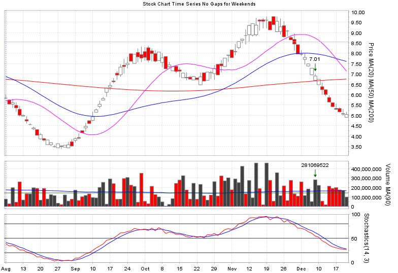

# jfreechart-builder

A [builder pattern](https://en.wikipedia.org/wiki/Builder_pattern) module for working with the [jfreechart](https://github.com/jfree/jfreechart) library.

It's a companion to [ChartFactory.java](https://github.com/jfree/jfreechart/blob/master/src/main/java/org/jfree/chart/ChartFactory.java) for using a declarative approach to creating complex charts with fewer lines of code.


## Features

* XY time series charts using [CombinedDomainXYPlot](https://github.com/jfree/jfreechart/blob/master/src/main/java/org/jfree/chart/plot/CombinedDomainXYPlot.java) for data alignment on sub-plots
* Time gap removal solution
* Time axis tick format control
* General XY time series charts
* Stock market OHLC candlestick charts
* Stock market volume bar charts
* Markers
* Annotations (arrows, text, lines, boxes)
* Set various colors
* Toggle grid lines
* [Demo app](./demo-app/src/main/java/com/jfcbuilder/demo/JFreeChartBuilderDemo.java) for testing and prototyping

In the future, more facilities may be added to leverage more of what
[jfreechart](https://github.com/jfree/jfreechart) provides.


## Samples


### A simple annotated plot

```
ChartBuilder.get()
  .title("Simple Time Series With Annotations")
  .timeData(timeArray)
  .xyPlot(XYTimeSeriesPlotBuilder.get().gridLines()
    .series(XYTimeSeriesBuilder.get().name("Amplitude").data(array1).color(Color.BLUE).style(SOLID_LINE))
    .annotation(XYArrowBuilder.get().x(arrowX).y(arrowY).angle(180.0).color(Color.RED).text(arrowTxt))
    .annotation(XYArrowBuilder.get().x(arrowX).y(arrowY).angle(0.0).color(Color.RED))
    .annotation(XYTextBuilder.get().x(arrowX).y(arrowY).color(DARK_GREEN)
        .text("This value!").textPaddingLeft(5).textAlign(TextAnchor.BASELINE_LEFT).angle(90.0)))
  .build();
```


### Multiple series plots

```
ChartBuilder.get()

  .title("Multi Plot Minute Time Series")
  .timeData(timeArray)

  .xyPlot(XYTimeSeriesPlotBuilder.get().yAxisName("Values")
    .backgroundColor(Color.DARK_GRAY).axisColor(Color.RED).axisFontColor(Color.BLUE).gridLines()
    .series(XYTimeSeriesBuilder.get().data(array1).color(Color.YELLOW).style(SOLID_LINE))
    .series(XYTimeSeriesBuilder.get().data(array2).color(Color.RED).style(SOLID_LINE))
    .series(XYTimeSeriesBuilder.get().data(array3).color(Color.GREEN).style(SOLID_LINE))
    .series(XYTimeSeriesBuilder.get().data(array4).color(Color.MAGENTA).style(SOLID_LINE)))

  .xyPlot(XYTimeSeriesPlotBuilder.get().yAxisName("Amplitudes").noGridLines()
    .series(XYTimeSeriesBuilder.get().data(array2).color(Color.BLACK).style(SOLID_LINE))
    .series(XYTimeSeriesBuilder.get().data(array3).color(Color.LIGHT_GRAY).style(SOLID_LINE)))

  .xyPlot(XYTimeSeriesPlotBuilder.get().yAxisName("Series 1")
    .backgroundColor(DARK_GREEN).axisColor(Color.RED).axisFontColor(Color.BLUE).gridLines()
    .series(XYTimeSeriesBuilder.get().data(array1).color(Color.GREEN).style(SOLID_LINE)))

  .xyPlot(XYTimeSeriesPlotBuilder.get().yAxisName("Series 2")
    .backgroundColor(DARK_RED).axisColor(Color.RED).axisFontColor(Color.BLUE).gridLines()
    .series(XYTimeSeriesBuilder.get().data(array2).color(Color.RED).style(SOLID_LINE)))

  .xyPlot(XYTimeSeriesPlotBuilder.get().yAxisName("Series 3")
    .backgroundColor(DARK_BLUE).axisColor(Color.RED).axisFontColor(Color.BLUE).gridLines()
    .series(XYTimeSeriesBuilder.get().data(array3).color(Color.CYAN).style(SOLID_LINE)))

  .build();
```


### Stock market plots

```
ChartBuilder.get()

  .title("Stock Chart Time Series With Weekend Gaps, Lines, and Annotations")
  .timeData(timeArray)

  .xyPlot(OhlcPlotBuilder.get().yAxisName("Price").plotWeight(3).gridLines()
    .series(OhlcSeriesBuilder.get().ohlcv(dohlcv).upColor(Color.WHITE).downColor(Color.RED))
    .series(XYTimeSeriesBuilder.get().name("MA(20)").data(sma20).color(Color.MAGENTA).style(SOLID_LINE))
    .series(XYTimeSeriesBuilder.get().name("MA(50)").data(sma50).color(Color.BLUE).style(SOLID_LINE))
    .series(XYTimeSeriesBuilder.get().name("MA(200)").data(sma200).color(Color.RED).style(SOLID_LINE))
    .annotation(XYArrowBuilder.get().x(stockEventDate).y(stockEventPrice).angle(270.0).color(DARK_GREEN)
      .textAlign(TextAnchor.BOTTOM_CENTER).text(String.format("%.2f", stockEventPrice)))
    .marker(MarkerBuilder.get().horizontal().at(resistanceLevel).color(Color.LIGHT_GRAY).style(SOLID_LINE)))

  .xyPlot(VolumeXYPlotBuilder.get().yAxisName("Volume").yTickFormat(volNumFormat).gridLines()
    .series(VolumeXYTimeSeriesBuilder.get().ohlcv(dohlcv).upColor(Color.DARK_GRAY).downColor(Color.RED))
    .series(XYTimeSeriesBuilder.get().name("MA(90)").data(volSma90).color(Color.BLUE).style(SOLID_LINE))
    .annotation(XYArrowBuilder.get().x(stockEventDate).y(stockEventVolume).angle(270.0).color(DARK_GREEN)
      .textAlign(TextAnchor.BOTTOM_CENTER).text(String.format("%.0f", stockEventVolume)))
    .marker(MarkerBuilder.get().horizontal().at(volumeLine).color(DARK_GREEN).style(SOLID_LINE)))

  .xyPlot(XYTimeSeriesPlotBuilder.get().yAxisName("Stoch").yAxisRange(0.0, 100.0).yAxisTickSize(50.0).gridLines()
    .series(XYTimeSeriesBuilder.get().name("K(" + K + ")").data(stoch.getPctK()).color(Color.RED).style(SOLID_LINE))
    .series(XYTimeSeriesBuilder.get().name("D(" + D + ")").data(stoch.getPctD()).color(Color.BLUE).style(SOLID_LINE))
    .marker(MarkerBuilder.get().horizontal().at(80.0).color(Color.BLACK).style(SOLID_LINE))
    .marker(MarkerBuilder.get().horizontal().at(50.0).color(Color.BLUE).style(SOLID_LINE))
    .marker(MarkerBuilder.get().horizontal().at(20.0).color(Color.BLACK).style(SOLID_LINE)))

  .build();
```


### Time Gap Removal

Implements a solution for removing visible time gaps where no data exists (like on weekends). Accomplishes this with a family of adapter classes mapping `NumberAxis` values as indices in time value arrays.

Configured using `showTimeGaps(boolean)`:

```
ChartBuilder.get()

  .title("Stock Chart Time Series No Gaps for Weekends")
  .showTimeGaps(false)

  ...
```



**Note: the x-axis month label in the gapless time chart currently doesn't always correspond to the first day (or trading day) of the month.**


### Time Axis Tick Label Formats

You can supply `DateFormat` instances to render time axis tick labels by calling  `dateFormat(DateFormat format)`. You can even implement your own sub-class.

You can also set the vertical label flag to draw them vertically.


```
ChartBuilder.get()

  .dateFormat( /* supply your DateFormat instance here */ )

  .verticalTickLabels(true)

  ...
```


### Convenience Minimal Tick Format

An optional [MinimalDateFormat](./framework/src/main/java/com/jfcbuilder/types/MinimalDateFormat.java) class is implemented to format dates with month letter(s) on first instance of a new month then only month days until a new month is reached.


## Javadoc

See the [Builders Summary](https://matoos32.github.io/jfreechart-builder-docs/javadoc/com/jfcbuilder/builders/package-summary.html)
to browse the public API.


## Demo App

See the [demo-app](./demo-app) solution for an interactive demo. Used for development and testing.


## Incorporating into your project

The module is not published to Maven Central so you must build the solution locally and install it in local Maven repositories.


### Prerequisites

* JDK 8 or greater [[1](https://openjdk.java.net/)] [[2](https://www.oracle.com/java/)] installed.
* [Apache Maven](https://maven.apache.org/) installed.
* Internet connection for Maven dependency downloads or you add those to your local Maven repo yourself.


### Installing source code

```
git clone <this repo's URL>
```


### Versioning

The major and minor numbers are the same as the **jfreechart** major and minor to denote compatibility.
The incremental ("patch") number is the monolithic version number of **jfreechart-builder**.


### Branching model

If you want the latest and greatest contributions use the `develop` branch. These commits give you a
preview of what's to come.

Each time `develop` is merged into `main`, a version tag is added onto that merge commit.
Each commit to `main` represents the next released version.


### Folder Structure

[framework/](./framework) contains the builder library code and produces the consumable `jfreechart-builder` JAR file.

[demo-app/](./demo-app) contains the demo app code and produces the launchable `jfreechart-builder-demo` JAR file.


### Building

```
cd path/to/cloned/repo

git checkout <desired branch or tag>
```


#### Simple build

Build everything:

```
mvn package
```

The jars will be in the `framework/target/` and `demo-app/target/` folders.


Build each module independently:

```
cd framework
mvn package

cd ../demo-app
mvn package
```

#### Build and install the jars into your Maven repo

Build and install everything:

```
mvn install
```

Build and install each module independently:

```
cd framework
mvn install

cd ../demo-app
mvn install
```

### Testing

Run the demo-app from your IDE or launch it from the command line:

```
java -jar jfreechart-builder-demo.jar
```


### Generate and view Javadoc

```
mvn javadoc:javadoc -Dsource=8
```

Use a browser to open `framework/target/site/apidocs/index.html`

Alternatively, run the generation script by specifying what version tag to associate with the Javadoc:

```
./scripts/generate-javadoc.sh v1.5.6
```

That output will be in `target/site/apidocs/javadoc`


### Add the jfreechart-builder JAR to a client project

Add this dependency to your project's `.pom` file:

```
<dependency>
  <groupId>com.jfcbuilder</groupId>
  <artifactId>jfreechart-builder</artifactId>
  <version>1.5.6</version>
<dependency>
```

## Test Coverage Warning

Testing of `jfreechart-builder` is limited to manually running the `jfreechart-builder-demo` application locally on Windows or Linux. It's rarely (if ever) run on both operating systems for the same code changes being merged. As of this writing the author(s)/maintainer(s) have not tested it on MacOS.

There is a reliance on the cross-platform natured promise of Java.

There are currently no runnable or automated unit tests, integration tests, regression tests, and the like.

Testing is done by visual inspection of the `jfreechart-builder-demo` app user interface.

You should thoroughly test the use of `jfreechart-builder` in your project and environment to satisfy yourself it does what you need and expect.

If you feel a capability is missing or there's a bug feel free to create an issue or start a discussion thread. Contributions are also welcome (see *Contributing* below)!

## Thread-safety and garbage collection

No thread-safety measures are deliberately taken. If you require thread-safety then provide deep copies of objects, don't share builders, don't share charts, or add synchronization to your business logic.

Generally, primitive data arrays are copied into **jfreechart** objects. **jfreechart-builder** will maintain references to other objects passed-in like strings, colors, and drawing strokes. When the builders and charts they produce go out of scope,
the objects you provided (and other objects that may be referencing them) should be garbage collected as applicable.


## License

**jfreechart-builder** is not affiliated with the **jfreechart** project but for compatibility it and the jfreechart-builder-demo app are provided under the terms of the same [LGPL 2.1 license](./license-LGPL.txt).

You should be aware of the contents of the **jfreechart-builder** JAR file built from this project.

It should contain the compiled `.class` files only of **jfreechart-builder** and should not incorporate any from **jfreechart**, however you must verify its contents to know what the build tools are actually producing.

If you need clarification on the LGPL vs. Java, please see the [FSF's tech note about it](https://www.gnu.org/licenses/lgpl-java.html).


## Contributing

Contributions are welcome and will be accepted as the maintainers' time permits.

* Please use indentations of two spaces (no tabs)
* Wrap lines at a width of 120 characters.
* To help others, write good Javadoc at least for interfaces, class descriptions, and public methods.
